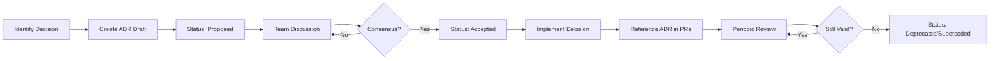

# Architecture Decision Records (ADRs)

This directory contains Architecture Decision Records (ADRs) for the Ghost Protocol project.

## What is an ADR?

An **Architecture Decision Record (ADR)** is a document that captures an important architectural decision made along with its context and consequences.

ADRs help us:
- Document **why** decisions were made, not just **what** was decided
- Provide context for future team members
- Track evolution of architecture over time
- Avoid revisiting already-settled debates
- Learn from past decisions (good and bad)

## When to Create an ADR?

Create an ADR when making decisions about:

### Infrastructure & Framework Choices
- Choosing frameworks (Next.js vs Remix, NestJS vs Express)
- Database selection (PostgreSQL, MongoDB, Redis)
- Cloud providers and hosting platforms
- CI/CD pipeline tools

### Architectural Patterns
- API design patterns (REST, GraphQL, RPC)
- State management approach (Redux, Zustand, Context)
- Authentication/authorization strategy
- Microservices vs monolith decisions

### Major Technical Changes
- Database schema changes affecting multiple modules
- Adding new services or dependencies
- Changing build tools or deployment process
- Security implementations (encryption, rate limiting)

### Cross-Cutting Concerns
- Logging and monitoring strategy
- Error handling patterns
- Testing strategy (unit, integration, E2E)
- Performance optimization approaches

## When NOT to Create an ADR?

Skip ADRs for:
- Minor code refactoring
- Bug fixes
- UI/UX tweaks that don't affect architecture
- Temporary workarounds or experiments

## ADR Process

### 1. Propose
Create ADR with status `Proposed` when exploring options.

### 2. Discuss
Share with team, gather feedback, update with new insights.

### 3. Decide
Once consensus reached, change status to `Accepted` and document final decision.

### 4. Implement
Reference ADR in PRs implementing the decision.

### 5. Review
Periodically review ADRs (set review dates in each ADR).

### 6. Update Status
- `Deprecated`: Decision no longer applies
- `Superseded`: Replaced by newer ADR (link to new one)

## ADR Naming Convention

```
ADR-YYYYMMDD-short-title.md
```

Examples:
- `ADR-20251110-tech-stack-selection.md`
- `ADR-20251115-database-schema-design.md`
- `ADR-20251120-authentication-strategy.md`

## ADR Structure

Use the template in [`template.md`](./template.md).

Required sections:
1. **Context and Problem Statement**: What's the issue?
2. **Decision Drivers**: What forces influenced the decision?
3. **Considered Options**: What alternatives were evaluated?
4. **Decision Outcome**: What was chosen and why?
5. **Consequences**: What are the trade-offs?

## Quick Start

### Creating a New ADR

```bash
# 1. Copy template
cp doc/adr/template.md doc/adr/ADR-$(date +%Y%m%d)-your-title.md

# 2. Edit the new file
# Fill in all sections with your decision context

# 3. Share with team for review
# Open PR or share in team chat

# 4. Mark as Accepted once consensus reached
```

### Example ADR Workflow



## Existing ADRs

| ADR | Title | Status | Date | Phase |
|-----|-------|--------|------|-------|
| [20251115-001](./ADR-20251115-001-tech-stack-selection.md) | Tech Stack Selection | ✅ Accepted | 2025-11-15 | Phase 0.1 |
| [20251115-002](./ADR-20251115-002-mono-repo-structure.md) | Mono-Repo Structure & Dependency Management (pnpm) | ✅ Accepted | 2025-11-15 | Phase 0.1 |
| [20251115-003](./ADR-20251115-003-cicd-pipeline-design.md) | CI/CD Pipeline Design | ✅ Accepted | 2025-11-15 | Phase 0.1 |
| [20251115-004](./ADR-20251115-004-development-environment-setup.md) | Development Environment Setup | ✅ Accepted | 2025-11-15 | Phase 0.1 |

**Update (2025-11-15):** All Phase 0.1 ADRs approved and accepted. Product ecosystem aligned (ChainGhost unified, G3Mail, Ghonity), pnpm workspace enforcement implemented, and all documentation synchronized.

## Best Practices

### DO:
- Write ADRs **before** implementing big changes
- Include **specific examples** and data when possible
- Document **all serious options considered**, not just the winner
- Be honest about **trade-offs and negative consequences**
- Reference ADRs in code comments for complex decisions
- Review ADRs when revisiting related areas

### DON'T:
- Don't write ADRs after the fact (retroactive justification)
- Don't hide alternative options that were considered
- Don't oversell the chosen option (acknowledge downsides)
- Don't let ADRs become stale (review and update/deprecate)
- Don't create ADRs for trivial decisions

## Resources

- [ADR GitHub Org](https://adr.github.io/)
- [Documenting Architecture Decisions](https://cognitect.com/blog/2011/11/15/documenting-architecture-decisions)
- [Architecture Decision Records: When Should I Write One?](https://www.thoughtworks.com/en-us/insights/blog/architecture/architecture-decision-records-when-should-i-write-one)

## Contributing

When adding ADRs:
1. Use the template
2. Follow naming convention
3. Update the table above with your ADR
4. Get at least 2 team member reviews before marking Accepted
5. Link related ADRs (if superseding or building on previous decisions)

---

**Maintained by:** Ghost Protocol Development Team  
**Last Updated:** November 11, 2025
