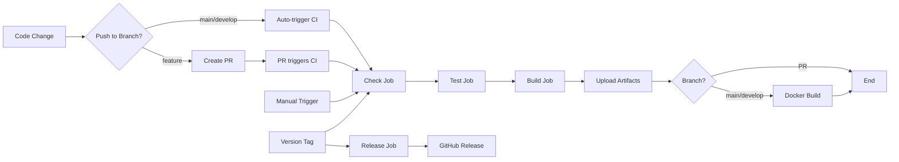

# Blockchain Node Build Guide

**Last Updated:** November 17, 2025  
**Purpose:** Guide for building Ghost Chain node using GitHub Actions (since Replit doesn't support full Rust/WASM toolchain)

---

## 🎯 Overview

Ghost Protocol blockchain node is built using **Substrate framework** which requires:
- Rust toolchain
- wasm32-unknown-unknown target
- Protocol Buffers compiler (protoc)
- Heavy compilation (not feasible in Replit environment)

**Solution:** Use GitHub Actions as build environment → Download binary artifacts → Test in Replit.

---

## 📋 Prerequisites

1. GitHub repository with push access
2. GitHub CLI installed (optional, but recommended)
3. Git configured and authenticated

---

## 🚀 Build Methods

### Method 1: Manual Workflow Trigger (Recommended for Testing)

GitHub Actions workflow supports manual triggering via `workflow_dispatch`:

#### Using GitHub Web UI:

1. Go to repository: `https://github.com/YOUR_ORG/ghost-protocol`
2. Navigate to **Actions** tab
3. Select **"Blockchain Node CI"** workflow
4. Click **"Run workflow"** button
5. Select branch (main/develop)
6. Click **"Run workflow"** (green button)
7. Wait for workflow to complete (~15-30 minutes)
8. Download artifacts from workflow run page

#### Using GitHub CLI:

```bash
# Trigger workflow on current branch
gh workflow run blockchain-node-ci.yml

# Trigger on specific branch
gh workflow run blockchain-node-ci.yml --ref develop

# Check workflow run status
gh run list --workflow=blockchain-node-ci.yml --limit 5

# Watch workflow run in real-time
gh run watch

# Download artifacts from latest successful run
gh run download --name ghost-node-linux-amd64
```

---

### Method 2: Push to Main/Develop (Automatic)

Workflow automatically runs on every push to `main` or `develop` branches:

```bash
# Make changes to blockchain code
cd packages/chain/node-core

# Commit changes
git add .
git commit -m "feat(chain): update runtime configuration"

# Push to develop (triggers CI)
git push origin develop

# Wait for workflow to complete
# Check status: gh run list --workflow=blockchain-node-ci.yml
```

---

### Method 3: Create Version Tag (Full Release)

For production releases with GitHub Release creation:

```bash
# Create and push version tag
git tag -a v0.1.0 -m "Release v0.1.0: Initial testnet"
git push origin v0.1.0

# This triggers:
# 1. Check job (lint, format, clippy)
# 2. Test job (unit tests)
# 3. Build job (multi-platform binaries)
# 4. Docker job (container image)
# 5. Release job (GitHub Release with artifacts)
```

---

## 📦 Available Artifacts

After successful workflow run, following artifacts are available:

### Binary Artifacts:

| Artifact Name | Platform | Architecture | Use Case |
|---------------|----------|--------------|----------|
| `ghost-node-linux-amd64` | Linux | x86_64 | Testing in Replit, AWS EC2 |
| `ghost-node-linux-arm64` | Linux | ARM64 | AWS Graviton, Raspberry Pi |
| `ghost-node-macos-amd64` | macOS | x86_64 | Intel Mac development |

### Docker Images (on branch push/tag):

```bash
# Pull Docker image (branch-based)
docker pull ghcr.io/YOUR_ORG/ghost-protocol/ghost-node:develop

# Pull Docker image (commit SHA)
docker pull ghcr.io/YOUR_ORG/ghost-protocol/ghost-node:develop-abc1234

# Pull latest (main branch)
docker pull ghcr.io/YOUR_ORG/ghost-protocol/ghost-node:latest
```

---

## 🔽 Downloading Artifacts to Replit

### Using Helper Script (Automated):

```bash
# Download latest successful build artifact
./scripts/download-chain-binary.sh

# Download specific workflow run
./scripts/download-chain-binary.sh <run-id>

# Download and verify checksums
./scripts/download-chain-binary.sh --verify
```

### Manual Download:

#### Option 1: GitHub CLI

```bash
# List recent workflow runs
gh run list --workflow=blockchain-node-ci.yml --limit 5

# Download artifact from specific run
gh run download <run-id> --name ghost-node-linux-amd64

# Extract and make executable
mv ghost-node-linux-amd64 bin/ghost-node
chmod +x bin/ghost-node
```

#### Option 2: GitHub Web UI

1. Go to **Actions** tab → Select workflow run
2. Scroll to **Artifacts** section (bottom of page)
3. Click **ghost-node-linux-amd64** to download
4. Extract to `bin/` directory:
   ```bash
   unzip ghost-node-linux-amd64.zip
   mv ghost-node-linux-amd64 bin/ghost-node
   chmod +x bin/ghost-node
   ```

#### Option 3: cURL (requires GitHub token)

```bash
# Get artifact download URL
ARTIFACT_URL=$(gh api \
  -H "Accept: application/vnd.github+json" \
  /repos/YOUR_ORG/ghost-protocol/actions/artifacts \
  --jq '.artifacts[] | select(.name=="ghost-node-linux-amd64") | .archive_download_url' \
  | head -1)

# Download artifact
curl -L \
  -H "Authorization: Bearer $GITHUB_TOKEN" \
  -o ghost-node-linux-amd64.zip \
  "$ARTIFACT_URL"

# Extract
unzip ghost-node-linux-amd64.zip
mv ghost-node-linux-amd64 bin/ghost-node
chmod +x bin/ghost-node
```

---

## ✅ Verify Binary

After downloading, verify the binary works:

```bash
# Check version
./bin/ghost-node --version

# Expected output:
# ghost-chain-runtime 0.1.0-abc1234

# Run in dev mode (single validator)
./bin/ghost-node --dev --tmp

# Expected output:
# 2025-11-17 10:00:00 Ghost Chain Node
# 2025-11-17 10:00:00 ✨ version 0.1.0-abc1234
# 2025-11-17 10:00:00 ❤️  by Ghost Protocol Team
# 2025-11-17 10:00:00 📋 Chain specification: Development
# 2025-11-17 10:00:00 🏷  Node name: xxx
# 2025-11-17 10:00:00 👤 Role: AUTHORITY
# ...
```

---

## 🧪 Running Testnet

### Option 1: Single Node (Development)

```bash
# Start development node with temporary database
./bin/ghost-node --dev --tmp

# Start with persistent database
./bin/ghost-node --dev --base-path ./testnet-data

# With custom port
./bin/ghost-node --dev --tmp \
  --rpc-port 9944 \
  --port 30333
```

### Option 2: Multi-Node Testnet (3 Validators)

See `docs/testnet-setup.md` for complete multi-node setup.

---

## 📊 Workflow Status

Check current workflow status:

```bash
# List recent runs
gh run list --workflow=blockchain-node-ci.yml --limit 10

# View specific run
gh run view <run-id>

# Watch running workflow
gh run watch <run-id>

# View workflow logs
gh run view <run-id> --log

# Download workflow logs
gh run view <run-id> --log > workflow-logs.txt
```

---

## 🐛 Troubleshooting

### Issue: Workflow Fails at Build Step

**Symptoms:** `cargo build --release` fails with compilation errors

**Solutions:**
1. Check Rust syntax errors in runtime code
2. Verify all dependencies in `Cargo.toml` are correct
3. Check workflow logs: `gh run view <run-id> --log`
4. Test locally with same Rust version:
   ```bash
   rustup install stable
   rustup target add wasm32-unknown-unknown
   cd packages/chain/node-core
   cargo build --release
   ```

---

### Issue: Artifact Not Found

**Symptoms:** "No artifacts found" when downloading

**Causes:**
- Workflow still running (wait for completion)
- Workflow failed before artifact upload step
- Artifact retention expired (30 days)

**Solutions:**
1. Check workflow status: `gh run list --workflow=blockchain-node-ci.yml`
2. Re-trigger workflow: `gh workflow run blockchain-node-ci.yml`
3. Check artifact retention in workflow YAML (line 228)

---

### Issue: Binary Permission Denied

**Symptoms:** `permission denied` when running `./bin/ghost-node`

**Solution:**
```bash
chmod +x bin/ghost-node
./bin/ghost-node --version
```

---

### Issue: Binary Not Working in Replit

**Symptoms:** `cannot execute binary file` or segfault

**Causes:**
- Wrong architecture (downloaded ARM64 instead of AMD64)
- Replit environment incompatibility

**Solutions:**
1. Ensure you downloaded `ghost-node-linux-amd64` (not ARM64)
2. Check binary:
   ```bash
   file bin/ghost-node
   # Expected: ELF 64-bit LSB executable, x86-64
   ```
3. Try Docker image instead:
   ```bash
   docker run --rm -p 9944:9944 -p 30333:30333 \
     ghcr.io/YOUR_ORG/ghost-protocol/ghost-node:develop \
     --dev --tmp --rpc-external
   ```

---

## 🔄 Continuous Integration Flow



---

## 📚 Related Documentation

- [ADR-006: Chain Ghost Node Architecture](../docs/adr/ADR-20251116-006-chain-ghost-node-architecture.md)
- [Testnet Setup Guide](./testnet-setup.md)
- [Runtime Development Guide](./runtime-development.md)
- [Workflow Configuration](./.github/workflows/blockchain-node-ci.yml)

---

## 🆘 Support

**Workflow Issues:** Check GitHub Actions logs and workflow YAML  
**Binary Issues:** Verify architecture and Replit environment compatibility  
**Runtime Issues:** See runtime development documentation

**Quick Help:**
```bash
# Workflow status
gh run list --workflow=blockchain-node-ci.yml --limit 5

# Download latest artifact
gh run download --name ghost-node-linux-amd64

# Verify binary
file ghost-node-linux-amd64
chmod +x ghost-node-linux-amd64
./ghost-node-linux-amd64 --version
```

---

**Next Steps:**
1. Trigger workflow: `gh workflow run blockchain-node-ci.yml`
2. Download artifact: `gh run download --name ghost-node-linux-amd64`
3. Test binary: `./ghost-node-linux-amd64 --dev --tmp`
4. Start testnet: See [Testnet Setup Guide](./testnet-setup.md)
