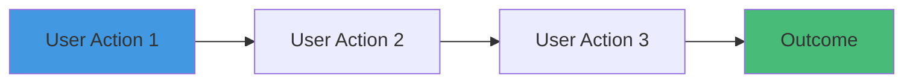
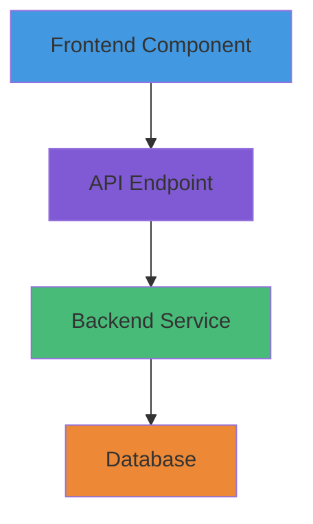

# Feature Request: [Feature Name]

**Date Submitted:** YYYY-MM-DD  
**Submitted By:** [Your Name]  
**Status:** [Proposed | Under Review | Approved | In Development | Shipped | Rejected]  
**Priority:** [P0 - Critical | P1 - High | P2 - Medium | P3 - Low]  
**Target Release:** [Version or Sprint]

---

## Feature Summary

[One-sentence description of the feature]

---

## Problem Statement

### What problem does this solve?

[Describe the user problem or pain point this feature addresses]

### Who is affected?

- [ ] All users
- [ ] Specific user segment: [describe]
- [ ] Internal team members
- [ ] Other: [specify]

### Current State

[Describe how users currently solve this problem, or why they can't solve it]

**Pain Points:**
- [Pain point 1]
- [Pain point 2]
- [Pain point 3]

---

## Proposed Solution

### High-Level Description

[Describe the feature at a high level. What will users be able to do?]

### User Stories

#### Primary User Story

```gherkin
As a [user type]
I want to [action]
So that [benefit]
```

**Acceptance Criteria:**
- [ ] [Criterion 1]
- [ ] [Criterion 2]
- [ ] [Criterion 3]

#### Secondary User Stories (Optional)

```gherkin
As a [user type]
I want to [action]
So that [benefit]
```

---

## User Experience

### User Flow



[Describe the step-by-step user journey]

### Mockups / Wireframes (Optional)

[Attach or link to design mockups, wireframes, or sketches]

**Mockup 1:** [Description]


---

## Success Metrics

### How will we measure success?

| Metric | Current | Target | Measurement Method |
|--------|---------|--------|-------------------|
| [Metric 1] | [Baseline] | [Goal] | [How to measure] |
| [Metric 2] | [Baseline] | [Goal] | [How to measure] |

**Example Metrics:**
- User adoption rate
- Feature usage frequency
- Task completion time reduction
- User satisfaction score (NPS)
- Conversion rate improvement

---

## Business Value

### Why should we build this?

- [ ] **Revenue Impact:** [How this affects revenue]
- [ ] **User Retention:** [How this improves retention]
- [ ] **Competitive Advantage:** [How this differentiates us]
- [ ] **Efficiency Gain:** [How this saves time/money]
- [ ] **Strategic Alignment:** [How this aligns with roadmap]

### Estimated Impact

- **Potential Users Affected:** [Number or percentage]
- **Revenue Impact:** [$ amount or % increase]
- **Time Savings:** [Hours saved per user/week]
- **Support Ticket Reduction:** [Expected % reduction]

---

## Technical Considerations

### High-Level Architecture (Optional)



[Brief technical overview - detailed design will be in TDD]

### Technical Complexity

- [ ] **Low:** Simple feature, few dependencies
- [ ] **Medium:** Moderate complexity, some integration work
- [ ] **High:** Complex feature, significant architectural changes

### Technical Risks

- **Risk 1:** [Describe risk]
  - **Mitigation:** [How to mitigate]
  
- **Risk 2:** [Describe risk]
  - **Mitigation:** [How to mitigate]

### Dependencies

**Internal Dependencies:**
- [ ] [Module or service this depends on]
- [ ] [Another dependency]

**External Dependencies:**
- [ ] [Third-party service or API]
- [ ] [Library or framework]

---

## Implementation Plan (High-Level)

### Phases

#### Phase 1: [Phase Name]
- [ ] [Task 1]
- [ ] [Task 2]
- **Estimated Effort:** [Story points]

#### Phase 2: [Phase Name]
- [ ] [Task 1]
- [ ] [Task 2]
- **Estimated Effort:** [Story points]

### Total Estimated Effort

- **Story Points:** [Total]
- **Time Estimate:** [Weeks or sprints]
- **Team Members Required:** [Number]

---

## Alternatives Considered

### Alternative 1: [Approach]

**Description:** [What is this alternative?]

**Pros:**
- [Pro 1]
- [Pro 2]

**Cons:**
- [Con 1]
- [Con 2]

**Why Not Chosen:** [Reason]

---

### Alternative 2: [Approach]

[Same structure as Alternative 1]

---

### Alternative 3: Do Nothing

**Pros:**
- No development effort required
- No risk of breaking existing functionality

**Cons:**
- [Pain points remain unaddressed]
- [Competitive disadvantage]
- [User churn risk]

---

## Open Questions

- [ ] **Question 1:** [Question that needs resolution]
  - **Owner:** [Name]
  - **Due:** [Date]
  
- [ ] **Question 2:** [Another question]
  - **Owner:** [Name]
  - **Due:** [Date]

---

## Security & Privacy Considerations

### Security

- [ ] Does this feature handle sensitive data?
- [ ] Does this require new authentication/authorization?
- [ ] Are there new attack vectors introduced?
- [ ] Does this comply with security best practices?

**Security Notes:** [Additional details]

### Privacy

- [ ] Does this collect new user data?
- [ ] Is user consent required (GDPR)?
- [ ] Can users delete their data?
- [ ] Is data encrypted at rest and in transit?

**Privacy Notes:** [Additional details]

---

## Support & Documentation

### Documentation Required

- [ ] User-facing documentation (help center)
- [ ] API documentation updates
- [ ] Internal developer documentation
- [ ] Release notes

### Training Required

- [ ] Customer support team training
- [ ] User onboarding materials
- [ ] Video tutorials
- [ ] In-app tooltips/guides

### Support Impact

**Expected Support Tickets:** [Increase/decrease/neutral]

**Common User Questions:**
1. [Question 1]
2. [Question 2]

---

## Rollout Strategy

### Launch Plan

- [ ] **Beta Testing:** [Duration and user group]
- [ ] **Feature Flag:** Gradual rollout (5% → 25% → 100%)
- [ ] **Announcement:** [Blog post / email / in-app notification]
- [ ] **Monitoring:** Track success metrics for [duration]

### Rollback Plan

**Rollback Criteria:**
- Error rate >X%
- User satisfaction <Y score
- Critical bugs discovered

**Rollback Method:**
- [ ] Feature flag disable
- [ ] Code revert
- [ ] Database rollback

---

## Stakeholder Feedback

### Product Team

**Feedback:** [Product manager feedback]

**Status:** [Approved / Needs Changes / Rejected]

---

### Engineering Team

**Feedback:** [Tech lead feedback]

**Technical Feasibility:** [Feasible / Needs Research / Not Feasible]

**Estimated Effort:** [Story points]

---

### Design Team

**Feedback:** [Designer feedback]

**Design Complexity:** [Low / Medium / High]

---

### Business Team

**Feedback:** [Business stakeholder feedback]

**ROI Estimate:** [Expected return on investment]

---

## Decision

### Status: [Approved | Rejected | Deferred]

**Decision Date:** YYYY-MM-DD

**Decision Maker:** [Name and role]

**Reasoning:** [Why this decision was made]

**Next Steps:**
- [ ] Create Technical Design Document
- [ ] Add to sprint backlog
- [ ] Assign to development team
- [ ] Schedule design review

---

## Related Links

- **GitHub Issue:** [Link]
- **Figma Design:** [Link]
- **User Research:** [Link]
- **Market Analysis:** [Link]
- **Related Features:** [Links]

---

## Changelog

| Version | Date | Changes | Author |
|---------|------|---------|--------|
| 1.0 | YYYY-MM-DD | Initial proposal | [Your Name] |

---

**Submitted by:** [Your Name]  
**Last Updated:** YYYY-MM-DD
