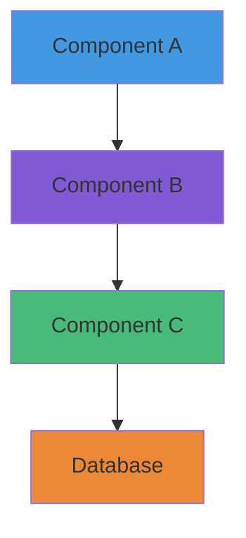
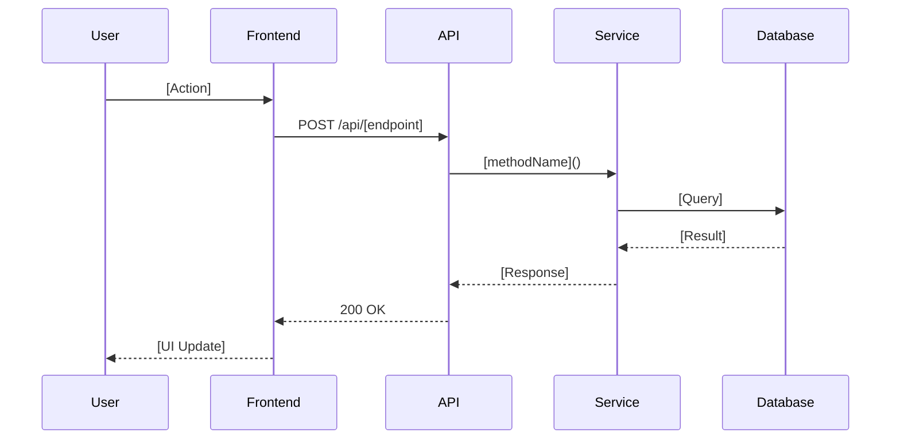

# Technical Design Document: [Feature Name]

**Version:** 1.0  
**Status:** [Draft | In Review | Approved | Implemented]  
**Author:** [Your Name]  
**Date Created:** YYYY-MM-DD  
**Last Updated:** YYYY-MM-DD  
**Related ADR:** [Link to ADR if applicable, or N/A]

---

## Executive Summary

**Purpose:** [1-2 sentences describing what this feature does and why it exists]

**Impact:** [High | Medium | Low]

**Effort Estimate:** [Story points or time estimate]

**Target Release:** [Sprint number or version number]

---

## Table of Contents

1. [Problem Statement](#problem-statement)
2. [Goals & Non-Goals](#goals--non-goals)
3. [User Stories](#user-stories)
4. [Technical Design](#technical-design)
5. [API Specification](#api-specification)
6. [Database Schema](#database-schema)
7. [Security Considerations](#security-considerations)
8. [Performance Considerations](#performance-considerations)
9. [Testing Strategy](#testing-strategy)
10. [Deployment Plan](#deployment-plan)
11. [Rollback Plan](#rollback-plan)
12. [Monitoring & Metrics](#monitoring--metrics)
13. [Dependencies](#dependencies)
14. [Open Questions](#open-questions)
15. [Alternatives Considered](#alternatives-considered)

---

## Problem Statement

### Current State

[Describe the current system behavior or limitation]

### Desired State

[Describe what the system should do after implementing this feature]

### Why Now?

[Explain why this feature is important right now. Business value, user pain point, technical debt, etc.]

---

## Goals & Non-Goals

### Goals

- [ ] [Primary goal 1]
- [ ] [Primary goal 2]
- [ ] [Primary goal 3]

### Non-Goals (Out of Scope)

- [ ] [What this feature will NOT do]
- [ ] [Related features that will be addressed separately]

### Success Metrics

| Metric | Current | Target | Measurement Method |
|--------|---------|--------|-------------------|
| [Metric 1] | [Value] | [Target] | [How to measure] |
| [Metric 2] | [Value] | [Target] | [How to measure] |

---

## User Stories

### Primary User Story

```gherkin
As a [user type]
I want to [action]
So that [benefit]
```

**Acceptance Criteria:**
- [ ] [Criterion 1]
- [ ] [Criterion 2]
- [ ] [Criterion 3]

### Secondary User Stories (Optional)

[List additional user stories if applicable]

---

## Technical Design

### Architecture Overview



[Describe the high-level architecture. Include diagrams showing component interactions.]

### Component Design

#### Frontend Components

**Component:** `[ComponentName]`

**Location:** `frontend/src/components/[path]`

**Responsibilities:**
- [Responsibility 1]
- [Responsibility 2]

**Props Interface:**
```typescript
interface [ComponentName]Props {
  [propName]: [type];  // [description]
  [propName]: [type];  // [description]
}
```

**State Management:**
- [How state is managed - local useState, Context, React Query, etc.]

---

#### Backend Services

**Service:** `[ServiceName]`

**Location:** `backend/src/[module]/[service-name].service.ts`

**Responsibilities:**
- [Responsibility 1]
- [Responsibility 2]

**Key Methods:**
```typescript
class [ServiceName] {
  async [methodName]([params]): Promise<[ReturnType]> {
    // [Brief description of what this method does]
  }
}
```

**Dependencies:**
- [Dependency 1]
- [Dependency 2]

---

### Data Flow



[Describe how data flows through the system from user action to database and back]

---

## API Specification

### New Endpoints

#### `POST /api/v1/[resource]`

**Description:** [What this endpoint does]

**Authentication:** Required (JWT Bearer token)

**Rate Limit:** [X requests per minute]

**Request:**
```typescript
{
  [fieldName]: [type];  // [description]
  [fieldName]: [type];  // [description]
}
```

**Response (200 OK):**
```typescript
{
  id: string;
  [fieldName]: [type];
  createdAt: string;
}
```

**Error Responses:**
- `400 Bad Request`: Invalid input
- `401 Unauthorized`: Missing or invalid token
- `403 Forbidden`: User lacks permission
- `404 Not Found`: Resource not found
- `429 Too Many Requests`: Rate limit exceeded
- `500 Internal Server Error`: Server error

**Example:**
```bash
curl -X POST https://api.ghostprotocol.io/api/v1/[resource] \
  -H "Authorization: Bearer $TOKEN" \
  -H "Content-Type: application/json" \
  -d '{
    "[fieldName]": "[value]"
  }'
```

---

### Modified Endpoints

#### `GET /api/v1/[existing-resource]`

**Changes:**
- Added new query parameter: `[paramName]`
- Modified response to include `[newField]`

**Migration Plan:**
- Versioned endpoint: Create `/api/v2/[resource]`
- Deprecation timeline: Mark v1 as deprecated in [version], remove in [version]

---

## Database Schema

### New Tables

#### `[table_name]`

```sql
CREATE TABLE [table_name] (
  id UUID PRIMARY KEY DEFAULT gen_random_uuid(),
  [column_name] [TYPE] NOT NULL,
  [column_name] [TYPE],
  created_at TIMESTAMPTZ DEFAULT NOW(),
  updated_at TIMESTAMPTZ DEFAULT NOW(),
  
  CONSTRAINT [constraint_name] FOREIGN KEY ([column]) 
    REFERENCES [other_table](id) ON DELETE CASCADE
);

CREATE INDEX idx_[table]_[column] ON [table_name]([column]);
```

**Indexes:**
- `idx_[table]_[column]`: For fast lookups on `[column]`

**Relationships:**
- One-to-Many with `[other_table]`
- Many-to-Many via `[junction_table]`

---

### Schema Modifications

**Table:** `[existing_table]`

**Changes:**
```sql
-- Add new column
ALTER TABLE [existing_table] 
  ADD COLUMN [new_column] [TYPE] DEFAULT [value];

-- Add index
CREATE INDEX idx_[table]_[column] ON [existing_table]([column]);
```

**Migration Strategy:**
1. Add new column with default value (non-breaking)
2. Backfill data for existing rows (background job)
3. Make column NOT NULL after backfill (breaking change, versioned)

---

## Security Considerations

### Authentication & Authorization

- [ ] Endpoint requires JWT authentication
- [ ] Role-based access control (RBAC) implemented
- [ ] Permission checks: `[permission_name]`

### Input Validation

- [ ] All inputs validated with Zod/class-validator
- [ ] SQL injection prevention (parameterized queries)
- [ ] XSS prevention (sanitize user input)
- [ ] CSRF protection (for state-changing operations)

### Data Privacy

- [ ] PII is encrypted at rest
- [ ] Sensitive data logged at appropriate level (no PII in logs)
- [ ] GDPR compliance: data deletion endpoint implemented

### Rate Limiting

- [ ] Rate limit applied: `[X] requests per [timeframe]`
- [ ] DDoS mitigation via Cloudflare/WAF

---

## Performance Considerations

### Database Optimization

- [ ] Indexes added for all query-heavy columns
- [ ] N+1 query prevention (use joins or DataLoader)
- [ ] Query result caching (Redis, cache TTL: `[duration]`)

### Frontend Optimization

- [ ] Code splitting for large components
- [ ] Lazy loading for below-the-fold content
- [ ] Image optimization (Next.js Image component)
- [ ] Bundle size impact: `+[X]KB` gzipped

### Backend Optimization

- [ ] Async processing for heavy tasks (job queue)
- [ ] Response pagination (default: 20 items, max: 100)
- [ ] Response caching (cache TTL: `[duration]`)

### Expected Performance

| Metric | Target | Current Baseline |
|--------|--------|------------------|
| API Response Time (p95) | <200ms | [X]ms |
| Database Query Time | <50ms | [X]ms |
| Frontend Load Time (LCP) | <2.5s | [X]s |

---

## Testing Strategy

### Unit Tests

**Coverage Target:** >80%

**Key Test Cases:**
- [ ] [Test case 1]
- [ ] [Test case 2]
- [ ] Edge case: [scenario]
- [ ] Error handling: [scenario]

**Example:**
```typescript
describe('[FeatureName]', () => {
  it('should [expected behavior]', async () => {
    // Arrange
    const input = [test data];
    
    // Act
    const result = await [function](input);
    
    // Assert
    expect(result).toEqual([expected output]);
  });
});
```

---

### Integration Tests

- [ ] API endpoint integration tests
- [ ] Database transaction tests
- [ ] Third-party service mocking

---

### E2E Tests (Optional)

- [ ] Critical user journey: [describe]
- [ ] Error scenarios: [describe]

---

## Deployment Plan

### Prerequisites

- [ ] Database migration tested in staging
- [ ] Feature flag created: `[flag_name]`
- [ ] Environment variables configured
- [ ] Third-party service credentials verified

### Deployment Steps

1. **Deploy Backend** (NestJS API)
   ```bash
   npm run build
   npm run migrate:up
   npm run deploy:staging
   ```

2. **Verify Backend Health**
   ```bash
   curl https://staging-api.ghostprotocol.io/health
   ```

3. **Deploy Frontend** (Next.js)
   ```bash
   npm run build
   npm run deploy:staging
   ```

4. **Enable Feature Flag** (gradual rollout)
   - 5% of users (monitoring for 24h)
   - 25% of users (monitoring for 24h)
   - 100% of users

### Rollout Schedule

- **Staging:** [Date]
- **Production (5%):** [Date]
- **Production (25%):** [Date]
- **Production (100%):** [Date]

---

## Rollback Plan

### Rollback Triggers

Rollback immediately if:
- Error rate >5%
- API response time p95 >500ms
- Database query failures >2%
- User-reported critical bugs >10

### Rollback Steps

1. **Disable Feature Flag**
   ```bash
   curl -X POST https://api.ghostprotocol.io/admin/flags/[flag_name]/disable
   ```

2. **Revert Database Migration** (if applicable)
   ```bash
   npm run migrate:down
   ```

3. **Redeploy Previous Version**
   ```bash
   git checkout [previous_release_tag]
   npm run deploy:production
   ```

4. **Verify Rollback Success**
   - Check error rates return to baseline
   - Verify user functionality restored

---

## Monitoring & Metrics

### Key Metrics to Monitor

| Metric | Threshold | Alert |
|--------|-----------|-------|
| API Error Rate | >2% | PagerDuty |
| Response Time (p95) | >500ms | Slack |
| Database Connection Pool | >80% | Email |
| Feature Adoption Rate | N/A | Dashboard |

### Logging

**Log Level:** INFO

**Key Events to Log:**
- Feature usage: `[event_name]`
- Errors: `[error_type]`
- Performance: `[operation_name] completed in [duration]ms`

**Log Format:**
```json
{
  "timestamp": "2025-11-10T10:00:00Z",
  "level": "INFO",
  "service": "[service_name]",
  "event": "[event_name]",
  "userId": "[user_id]",
  "metadata": { }
}
```

### Dashboards

- Grafana: `[dashboard_url]`
- Sentry: `[project_url]`

---

## Dependencies

### Internal Dependencies

- [ ] `[Module/Service Name]` - [Why needed]
- [ ] `[Another Module]` - [Why needed]

### External Dependencies

| Dependency | Version | Purpose | Risk |
|------------|---------|---------|------|
| [Library Name] | [X.Y.Z] | [Purpose] | [Low/Medium/High] |

### Dependency Risks

- **Risk:** [Describe risk]
- **Mitigation:** [How to mitigate]

---

## Open Questions

- [ ] **Question 1:** [Open question that needs resolution]
  - **Owner:** [Name]
  - **Due:** [Date]

- [ ] **Question 2:** [Another open question]
  - **Owner:** [Name]
  - **Due:** [Date]

---

## Alternatives Considered

### Alternative 1: [Approach Name]

**Description:** [Describe alternative approach]

**Pros:**
- [Pro 1]
- [Pro 2]

**Cons:**
- [Con 1]
- [Con 2]

**Why Not Chosen:** [Reason for rejection]

---

### Alternative 2: [Approach Name]

[Same structure as Alternative 1]

---

## Approval & Sign-off

| Role | Name | Status | Date |
|------|------|--------|------|
| **Author** | [Your Name] | ✅ Completed | YYYY-MM-DD |
| **Tech Lead** | [Name] | ⏳ Pending | - |
| **Product Manager** | [Name] | ⏳ Pending | - |
| **Security Review** | [Name] | ⏳ Pending | - |

---

## Revision History

| Version | Date | Changes | Author |
|---------|------|---------|--------|
| 1.0 | YYYY-MM-DD | Initial draft | [Your Name] |

---

**Maintained by:** [Your Name]  
**Last Reviewed:** YYYY-MM-DD  
**Next Review:** YYYY-MM-DD
