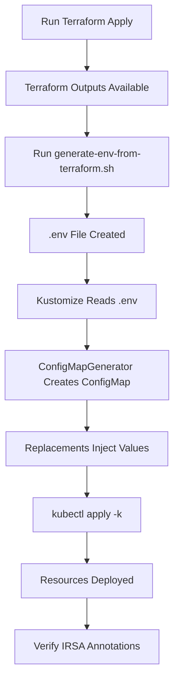

# Kustomize Replacements Pattern Guide

## Table of Contents

- [Overview](#overview)
- [Architecture](#architecture)
- [Key Features](#key-features)
- [Prerequisites](#prerequisites)
- [Quick Start](#quick-start)
- [Detailed Workflow](#detailed-workflow)
- [Directory Structure](#directory-structure)
- [Configuration Files](#configuration-files)
- [How It Works](#how-it-works)
- [Troubleshooting](#troubleshooting)
- [Best Practices](#best-practices)
- [Migration Guide](#migration-guide)

---

## Overview

The **Kustomize Replacements Pattern** is an automated approach to inject environment-specific values (AWS Account ID, IRSA Role ARNs, ECR URLs, etc.) into Kubernetes manifests without hardcoding or manual substitution.

### Problems Solved

1. ❌ **Hard-coded namespaces** in DNS names (e.g., `loki-write.ghost-protocol-monitoring.svc.cluster.local`)
2. ❌ **Placeholder values** requiring manual substitution (e.g., `arn:aws:iam::REPLACE_WITH_AWS_ACCOUNT_ID:role/...`)
3. ❌ **Manual scripts** not integrated into automated workflows

### Solution

✅ **Automated .env generation** from Terraform outputs  
✅ **Dynamic value injection** via Kustomize replacements  
✅ **Namespace-agnostic DNS** names for cross-environment portability  
✅ **GitOps-ready** with ArgoCD Config Management Plugin support

---

## Architecture

```
┌─────────────────────────────────────────────────────────────────────┐
│                        Deployment Workflow                           │
└─────────────────────────────────────────────────────────────────────┘
                                   │
                                   ▼
┌──────────────────────────────────────────────────────────────────────┐
│  Step 1: Generate .env from Terraform Outputs                        │
│  Script: scripts/generate-env-from-terraform.sh                      │
│                                                                       │
│  Input:  Terraform state (IAM roles, AWS account, region, etc.)     │
│  Output: overlays/{env}/.env                                         │
└──────────────────────────────────────────────────────────────────────┘
                                   │
                                   ▼
┌──────────────────────────────────────────────────────────────────────┐
│  Step 2: Kustomize ConfigMap Generator                               │
│  File: overlays/{env}/kustomization.yaml                             │
│                                                                       │
│  Input:  overlays/{env}/.env                                         │
│  Output: ConfigMap kustomize-values (contains all env variables)     │
└──────────────────────────────────────────────────────────────────────┘
                                   │
                                   ▼
┌──────────────────────────────────────────────────────────────────────┐
│  Step 3: Kustomize Replacements                                      │
│  File: overlays/{env}/kustomization.yaml                             │
│                                                                       │
│  Inject values from ConfigMap into:                                  │
│  - ServiceAccount annotations (IRSA ARNs)                            │
│  - Image repositories (ECR URLs)                                     │
│  - ConfigMaps (namespace-agnostic DNS)                               │
└──────────────────────────────────────────────────────────────────────┘
                                   │
                                   ▼
┌──────────────────────────────────────────────────────────────────────┐
│  Step 4: Deploy to Kubernetes                                        │
│  Command: kubectl apply -k overlays/{env}                            │
│                                                                       │
│  Result: Fully configured manifests with correct ARNs and values     │
└──────────────────────────────────────────────────────────────────────┘
```

---

## Key Features

### 1. Namespace-Agnostic DNS Names

**Before (Hard-coded):**
```yaml
memberlist:
  join_members:
    - loki-write-headless.ghost-protocol-monitoring.svc.cluster.local:7946
```

**After (Namespace-agnostic):**
```yaml
memberlist:
  join_members:
    - loki-write-headless:7946  # Works in any namespace
```

### 2. Dynamic IRSA ARN Injection

**Before (Placeholder):**
```yaml
apiVersion: v1
kind: ServiceAccount
metadata:
  name: api-gateway
  annotations:
    eks.amazonaws.com/role-arn: arn:aws:iam::REPLACE_WITH_AWS_ACCOUNT_ID:role/...
```

**After (Auto-injected):**
```yaml
apiVersion: v1
kind: ServiceAccount
metadata:
  name: api-gateway
  annotations:
    eks.amazonaws.com/role-arn: arn:aws:iam::123456789012:role/ghost-protocol-prod-api-gateway-pod-role
```

### 3. Automated Script Integration

**Manual Process (Before):**
1. Run Terraform
2. Manually copy ARNs from output
3. Manually edit 20+ YAML files
4. Risk of typos and inconsistencies

**Automated Process (After):**
1. Run: `./scripts/generate-env-from-terraform.sh production`
2. Run: `kubectl apply -k overlays/production`
3. Done! ✅

---

## Prerequisites

1. **Terraform Infrastructure Deployed**
   - EKS cluster with OIDC provider configured
   - IRSA IAM roles created (Stage 2 deployment)

2. **AWS CLI Configured**
   - Valid credentials with access to target AWS account
   - `aws sts get-caller-identity` should return account ID

3. **kubectl and Kustomize**
   - kubectl 1.14+ (includes Kustomize)
   - Cluster access configured

---

## Quick Start

### Step 1: Generate Environment-Specific .env File

```bash
# For production
./infra/k8s/scripts/generate-env-from-terraform.sh production

# For staging
./infra/k8s/scripts/generate-env-from-terraform.sh staging

# For development
./infra/k8s/scripts/generate-env-from-terraform.sh dev
```

**Output:**
```
🔧 Generating .env file for environment: production
━━━━━━━━━━━━━━━━━━━━━━━━━━━━━━━━━━━━━━━━━━━━━━━━━━━━━━━━━━━━━━━━━
✅ Terraform state found
🔍 AWS Account ID: 123456789012
🌍 AWS Region: us-east-1
📦 Namespace: ghost-protocol-prod
📥 Retrieving IRSA Role ARNs...
✅ IRSA roles retrieved successfully
🐳 ECR Repository: 123456789012.dkr.ecr.us-east-1.amazonaws.com/ghost-protocol
☸️  EKS Cluster: ghost-protocol-production
━━━━━━━━━━━━━━━━━━━━━━━━━━━━━━━━━━━━━━━━━━━━━━━━━━━━━━━━━━━━━━━━━
✅ .env file created: infra/k8s/overlays/production/.env
```

### Step 2: Review Generated .env File

```bash
cat infra/k8s/overlays/production/.env
```

**Example Output:**
```bash
# Auto-generated by generate-env-from-terraform.sh
# Environment: production
# Generated: 2024-11-16 12:00:00 UTC
# DO NOT EDIT MANUALLY - This file is auto-generated

# AWS Configuration
AWS_ACCOUNT_ID=123456789012
AWS_REGION=us-east-1
ECR_REPOSITORY_URL=123456789012.dkr.ecr.us-east-1.amazonaws.com/ghost-protocol

# Kubernetes Configuration
NAMESPACE=ghost-protocol-prod
CLUSTER_NAME=ghost-protocol-production

# IRSA Role ARNs
API_GATEWAY_ROLE_ARN=arn:aws:iam::123456789012:role/ghost-protocol-prod-api-gateway-pod-role
INDEXER_ROLE_ARN=arn:aws:iam::123456789012:role/ghost-protocol-prod-indexer-pod-role
RPC_ORCHESTRATOR_ROLE_ARN=arn:aws:iam::123456789012:role/ghost-protocol-prod-rpc-orchestrator-pod-role
AI_ENGINE_ROLE_ARN=arn:aws:iam::123456789012:role/ghost-protocol-prod-ai-engine-pod-role
LOKI_ROLE_ARN=arn:aws:iam::123456789012:role/ghost-protocol-prod-loki-pod-role

# DNS Configuration
MONITORING_NAMESPACE=ghost-protocol-prod
```

### Step 3: Test Kustomize Build

```bash
# Build manifests without applying
kubectl kustomize infra/k8s/overlays/production > /tmp/production-manifests.yaml

# Review the output
less /tmp/production-manifests.yaml
```

### Step 4: Deploy to Kubernetes

```bash
# Apply to cluster
kubectl apply -k infra/k8s/overlays/production

# Verify ServiceAccount annotations
kubectl get sa api-gateway -n ghost-protocol-prod -o yaml | grep role-arn
```

**Expected Output:**
```yaml
eks.amazonaws.com/role-arn: arn:aws:iam::123456789012:role/ghost-protocol-prod-api-gateway-pod-role
```

---

## Detailed Workflow

### Workflow Diagram



### Detailed Steps

#### 1. Terraform Deployment (Pre-requisite)

```bash
cd infra/terraform
terraform init
terraform apply -var-file="environments/prod/terraform.tfvars"
```

**Outputs Created:**
- `api_gateway_irsa_role_arn`
- `indexer_irsa_role_arn`
- `rpc_orchestrator_irsa_role_arn`
- `ai_engine_irsa_role_arn`
- `loki_irsa_role_arn`
- `eks_cluster_name`
- `aws_region`

#### 2. .env Generation

**Script Location:** `infra/k8s/scripts/generate-env-from-terraform.sh`

**What It Does:**
1. Validates Terraform state exists
2. Retrieves AWS account ID from `aws sts get-caller-identity`
3. Extracts IRSA role ARNs from Terraform outputs
4. Constructs ECR repository URL
5. Writes all values to `overlays/{env}/.env`

**Fallback Behavior:**
- If IRSA roles don't exist (Stage 1 deployment), uses constructed ARNs
- Warns user to re-run after Stage 2 deployment

#### 3. Kustomize ConfigMapGenerator

**Location:** `overlays/{env}/kustomization.yaml`

```yaml
configMapGenerator:
- name: kustomize-values
  envs:
  - .env
  options:
    disableNameSuffixHash: true
```

**Creates ConfigMap:**
```yaml
apiVersion: v1
kind: ConfigMap
metadata:
  name: kustomize-values
data:
  AWS_ACCOUNT_ID: "123456789012"
  API_GATEWAY_ROLE_ARN: "arn:aws:iam::123456789012:role/..."
  ...
```

#### 4. Kustomize Replacements

**Location:** `overlays/{env}/kustomization.yaml`

```yaml
replacements:
- source:
    kind: ConfigMap
    name: kustomize-values
    fieldPath: data.API_GATEWAY_ROLE_ARN
  targets:
  - select:
      kind: ServiceAccount
      name: api-gateway
    fieldPaths:
    - metadata.annotations.[eks.amazonaws.com/role-arn]
    options:
      create: true
```

**Effect:** Injects ARN from ConfigMap into ServiceAccount annotation

---

## Directory Structure

```
infra/k8s/
├── base/                           # Base Kubernetes manifests
│   ├── api-gateway/
│   ├── indexer/
│   ├── rpc-orchestrator/
│   ├── ai-engine/
│   └── monitoring/
│       ├── loki-write-configmap.yaml    # ✅ Now namespace-agnostic
│       ├── loki-read-configmap.yaml     # ✅ Now namespace-agnostic
│       ├── loki-backend-configmap.yaml  # ✅ Now namespace-agnostic
│       └── loki-gateway-configmap.yaml  # ✅ Now namespace-agnostic
│
├── overlays/                       # Environment-specific overlays
│   ├── production/
│   │   ├── kustomization.yaml      # ✅ Uses configMapGenerator + replacements
│   │   ├── .env                    # ⚠️ Generated, not committed
│   │   └── .env.example            # Example template
│   ├── staging/
│   │   ├── kustomization.yaml
│   │   ├── .env
│   │   └── .env.example
│   └── dev/
│       ├── kustomization.yaml
│       ├── .env
│       └── .env.example
│
├── scripts/
│   └── generate-env-from-terraform.sh  # ✅ Automation script
│
├── KUSTOMIZE_REPLACEMENTS_GUIDE.md     # This file
└── .gitignore                          # Excludes .env files
```

---

## Configuration Files

### 1. kustomization.yaml

```yaml
apiVersion: kustomize.config.k8s.io/v1beta1
kind: Kustomization

namespace: ghost-protocol-prod

bases:
- ../../base

# ConfigMap Generator
configMapGenerator:
- name: kustomize-values
  envs:
  - .env
  options:
    disableNameSuffixHash: true

# Replacements
replacements:
- source:
    kind: ConfigMap
    name: kustomize-values
    fieldPath: data.API_GATEWAY_ROLE_ARN
  targets:
  - select:
      kind: ServiceAccount
      name: api-gateway
    fieldPaths:
    - metadata.annotations.[eks.amazonaws.com/role-arn]
    options:
      create: true
```

### 2. .env (Auto-generated)

```bash
AWS_ACCOUNT_ID=123456789012
AWS_REGION=us-east-1
ECR_REPOSITORY_URL=123456789012.dkr.ecr.us-east-1.amazonaws.com/ghost-protocol
NAMESPACE=ghost-protocol-prod
API_GATEWAY_ROLE_ARN=arn:aws:iam::123456789012:role/ghost-protocol-prod-api-gateway-pod-role
# ... more values
```

---

## How It Works

### Example: IRSA ARN Injection

#### Before Replacement

**Base ServiceAccount:**
```yaml
apiVersion: v1
kind: ServiceAccount
metadata:
  name: api-gateway
```

**Kustomize Replacement:**
```yaml
- source:
    kind: ConfigMap
    name: kustomize-values
    fieldPath: data.API_GATEWAY_ROLE_ARN
  targets:
  - select:
      kind: ServiceAccount
      name: api-gateway
    fieldPaths:
    - metadata.annotations.[eks.amazonaws.com/role-arn]
    options:
      create: true  # Creates annotation if it doesn't exist
```

#### After Replacement

**Final ServiceAccount:**
```yaml
apiVersion: v1
kind: ServiceAccount
metadata:
  name: prod-api-gateway  # namePrefix applied
  namespace: ghost-protocol-prod
  annotations:
    eks.amazonaws.com/role-arn: arn:aws:iam::123456789012:role/ghost-protocol-prod-api-gateway-pod-role
  labels:
    environment: production
```

---

## Troubleshooting

### Issue 1: .env File Not Found

**Error:**
```
Error: file does not exist: .env
```

**Solution:**
```bash
# Generate .env file first
./infra/k8s/scripts/generate-env-from-terraform.sh production
```

### Issue 2: IRSA Role ARN is "null"

**Cause:** IRSA roles not created (Stage 1 deployment only)

**Solution:**
1. Complete Stage 2 Terraform deployment
2. Re-run script: `./scripts/generate-env-from-terraform.sh production`

### Issue 3: Kustomize Build Fails

**Error:**
```
Error: replacement target not found
```

**Diagnosis:**
```bash
# Validate kustomization.yaml syntax
kubectl kustomize infra/k8s/overlays/production --enable-alpha-plugins
```

**Common Causes:**
- Incorrect `fieldPath` in replacement
- Target resource doesn't exist in base
- Typo in resource name or kind

### Issue 4: ServiceAccount Missing Annotation After Deployment

**Diagnosis:**
```bash
# Check ServiceAccount
kubectl get sa api-gateway -n ghost-protocol-prod -o yaml

# Check if replacement was applied
kubectl kustomize infra/k8s/overlays/production | grep -A5 "kind: ServiceAccount"
```

**Solution:**
- Ensure `create: true` option is set in replacement
- Verify ConfigMap contains correct ARN
- Re-run deployment

---

## Best Practices

### 1. Never Commit .env Files

```bash
# .gitignore already includes
.env
```

### 2. Use .env.example as Template

```bash
# Copy example and edit manually if needed
cp overlays/production/.env.example overlays/production/.env
```

### 3. Re-generate .env After Infrastructure Changes

```bash
# After any Terraform apply
./scripts/generate-env-from-terraform.sh production
```

### 4. Validate Before Deploying

```bash
# Always test build first
kubectl kustomize overlays/production > /tmp/test.yaml
less /tmp/test.yaml
```

### 5. Use CI/CD Integration

```yaml
# In CI pipeline
- name: Generate .env
  run: ./infra/k8s/scripts/generate-env-from-terraform.sh ${{ env.ENVIRONMENT }}

- name: Deploy
  run: kubectl apply -k infra/k8s/overlays/${{ env.ENVIRONMENT }}
```

---

## Migration Guide

### From Old Pattern (Manual Substitution) to New Pattern (Replacements)

#### Step 1: Backup Old Patch Files

```bash
cd infra/k8s/overlays/production
mkdir -p .backup
mv *-sa-patch.yaml .backup/
```

#### Step 2: Generate .env File

```bash
./infra/k8s/scripts/generate-env-from-terraform.sh production
```

#### Step 3: Update kustomization.yaml

Remove:
```yaml
patchesStrategicMerge:
- api-gateway-sa-patch.yaml
- indexer-sa-patch.yaml
- rpc-orchestrator-sa-patch.yaml
- ai-engine-sa-patch.yaml
```

Add:
```yaml
configMapGenerator:
- name: kustomize-values
  envs:
  - .env
  options:
    disableNameSuffixHash: true

replacements:
- source:
    kind: ConfigMap
    name: kustomize-values
    fieldPath: data.API_GATEWAY_ROLE_ARN
  targets:
  - select:
      kind: ServiceAccount
      name: api-gateway
    fieldPaths:
    - metadata.annotations.[eks.amazonaws.com/role-arn]
    options:
      create: true
# ... repeat for other services
```

#### Step 4: Test Migration

```bash
# Build and compare
kubectl kustomize overlays/production > /tmp/new-build.yaml
diff /tmp/old-build.yaml /tmp/new-build.yaml
```

#### Step 5: Deploy

```bash
kubectl apply -k overlays/production
```

---

## References

- [Kustomize Documentation](https://kustomize.io/)
- [Kustomize Replacements](https://kubectl.docs.kubernetes.io/references/kustomize/kustomization/replacements/)
- [AWS EKS IRSA](https://docs.aws.amazon.com/eks/latest/userguide/iam-roles-for-service-accounts.html)
- [Terraform Outputs](https://www.terraform.io/language/values/outputs)

---

## Support

For issues or questions:
1. Check troubleshooting section above
2. Review script logs: `./scripts/generate-env-from-terraform.sh {env} 2>&1 | tee debug.log`
3. Validate Terraform state: `cd infra/terraform && terraform show`
4. Review Kustomize build: `kubectl kustomize overlays/{env} --enable-alpha-plugins`
